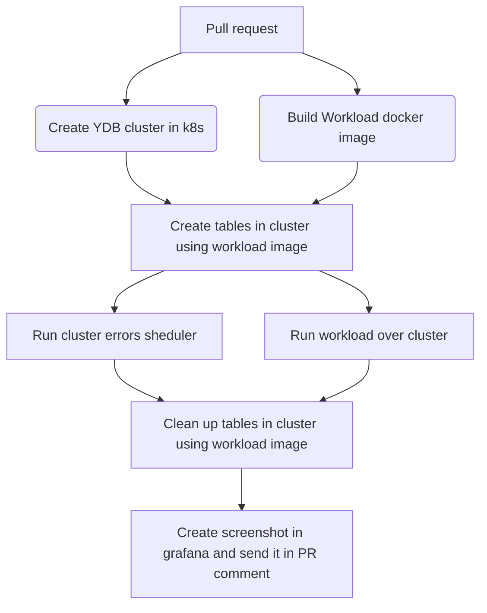
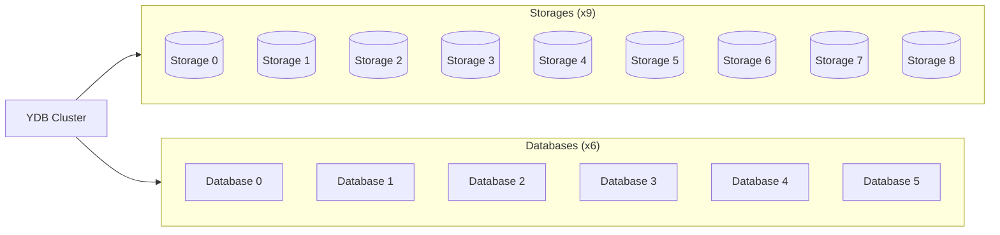

# slo-tests

### [Deployment and CI readme](/k8s/README.md)

This repo contains github workflows and actions to run SLO tests over YDB and YDB SDK's

Here is simple diagram what's happening inside:
 

The cluster that is processing workload's request is configured as follows:

